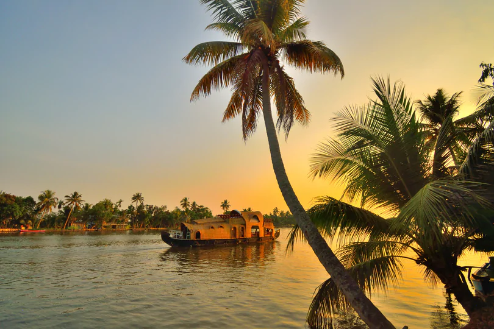

# Tourism-Website

### Kottayam Tourism Website

### Description

Welcome to the Kottayam Tourism website! This project showcases the beauty and attractions of Kottayam, a city rich in cultural heritage and natural beauty in the state of Kerala, India. The website provides information about top places to visit, heritage sites, and allows users to book their stay in various hotels.

### Technology Used

- HTML
- CSS
- JavaScript

### Features

#### Home
- Engaging image carousel showcasing the beauty of Kottayam.

#### Top Places
- Information about the city, its geography, and popular tourist attractions.
  
#### Heritage
- List of heritage sites with detailed descriptions and images.

#### Hotel Booking
- Form for users to book their stay, selecting a hotel, check-in/out dates, and specifying the number of rooms and guests.

#### Contact Us
- Contact form for users to reach out, along with displayed contact details.

